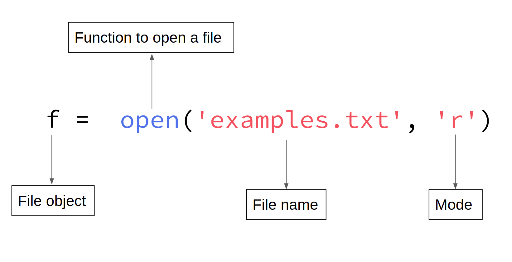
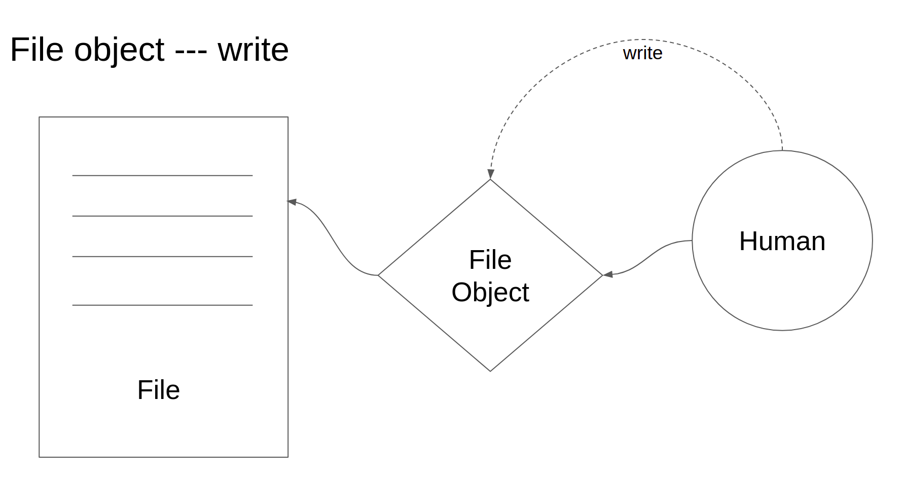

# Lesson 7.3

## File Object

As mentioned earlier, the `#!py open()` function returns a file object. The following image gives a better picture of the whole setup.

 

What is a file object? Let us use the following analogy: 

You are the CEO of a tech company. Even though you are good at multi-tasking, there are simply too many things for you to keep track of. To help you manage the mounting load of activities, you hire a personal assistant (PA). Think about the kind of work you generally assign to a PA. Let us say that you are meeting delegates from another company at 5:00 PM next Tuesday. The typical instruction to your PA would be this: "make a note of this meeting". Your PA would dutifully record this information in a file.

Few days later, you might be suddenly reminded of this important meeting. At this point, this would be your instruction: "fetch me the details of the meeting with those delegates". In both cases, notice that it is your PA who is interacting with a file. In the first instruction, your PA noted down the details of a meeting in a file. In the second instruction, your PA retrieved the information from the file.

The file object is your PA who mediates between you, the coder, and the file that resides on the hard disk of your computer. You pass an instruction to your file object, which does the job of reading and writing to a file. All communication between you and the file is routed through the file object.

### Mode

In the following sections, we will briefly discuss about the two modes that a file can be opened in. We will go in depth in later lessons.

#### Read mode

The dotted line in the image given below corresponds to the mode in which you wish to process the file. This instruction always originates from you and is directed at the file object. When you are reading from a file, information flows from the file, through the file object and reaches you. This represented by the solid arrow. 


To read a file, we open it in the read mode:

```python linenums="1"
f = open('<file_name>', 'r')
# ...
# code for reading something from file
# ...
f.close()
```

#### Write mode

When you are writing to a file, information flows from you, through the file object and to the file.



To write to a file, we open it in the write mode:

```python
f = open('<file_name>', 'w')
# ...
# code for writing something into the file
# ...
f.close()
```

In the next lesson, we will see some more aspects of file handling.
